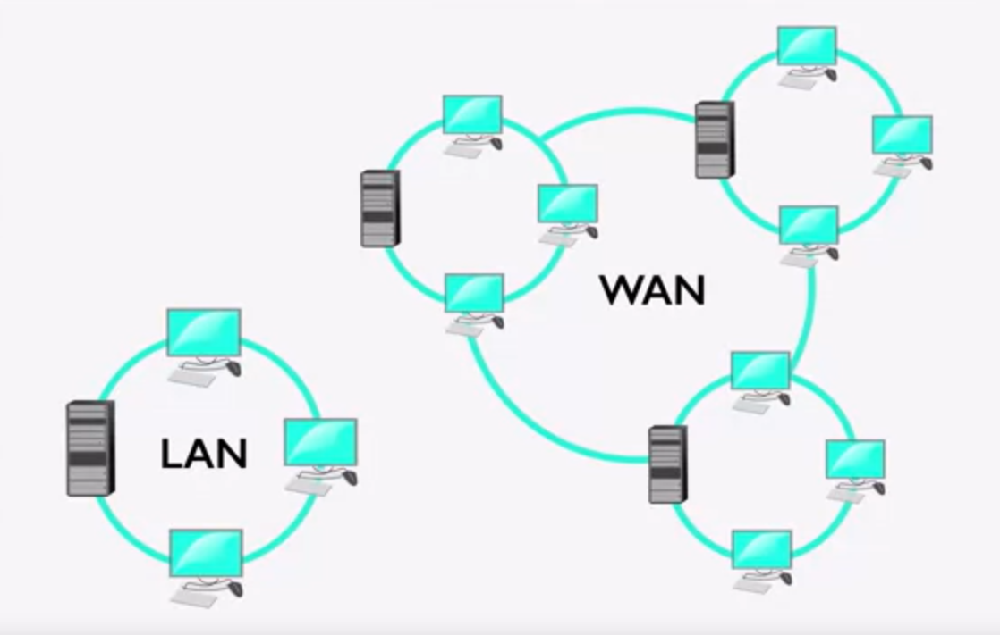

# How it Works: The "Magic" of Page Requests

## 1. How Does This All Work?
http://si.umich.edu

* When you type an address into the URL bar, what happens?
* Warning: This lecuture is heavy on the acronyms.

### 01. Client/Server Relationship
* Servers
    * Machines that hold shared resources
    * Always connected to the network

* Clients
    * Machines for personal use (laptops, phones, etc.)

### 02. Networks

* The Internet
    * LAN (Local Area Network)
        * Three computers sharing one server in a single office(left on the image above)
        * Multiple machines can share one resource.
            * e.g. a printer
    * WAN (Wide Area Network)
        * Three separate office sharing one resource.
            * e.g. an university server

### 03. Request/Response Cycle
* The client requests a page.
* A server responds with the appropriate files. 

## 2. Uniform Resource Locator (URL)
### 01. Components
* protocol: how to connect
* domain: the server*
* (optional) document: the specific file needed
    * Most pages are made up of multiple files

### 02. Protocols
* HTTP: Hypertext Transfer Protocol
* HTTPS: Secure Hypertext Transfer Protocol
* FTP: File Transfer Protocol

### 03. Domain Names
* Identifies the entity you want to connect to
    * umich.edu, google.com, wikipedia.org
* Each has different top-level domain