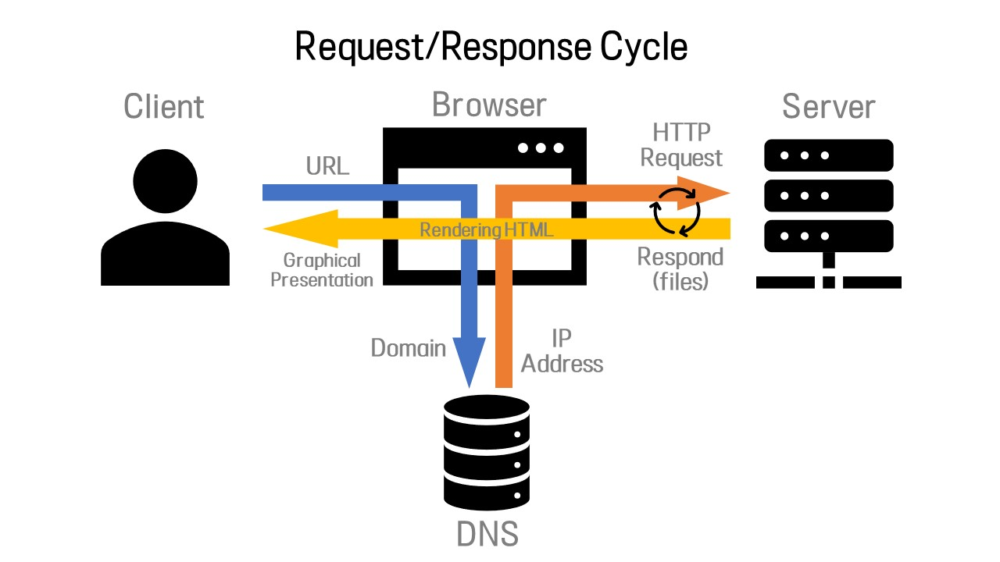

# How it Works: The "Magic" of Page Requests

## 1. How Does This All Work?
http://si.umich.edu

* When you type an address into the URL bar, what happens?
* Warning: This lecuture is heavy on the acronyms.

### 01. Client/Server Relationship
* Servers
    * Machines that hold shared resources
    * Always connected to the network

* Clients
    * Machines for personal use (laptops, phones, etc.)

### 02. Networks

* The Internet
    * LAN (Local Area Network)
        * Three computers sharing one server in a single office(left on the image above)
        * Multiple machines can share one resource.
            * e.g. a printer
    * WAN (Wide Area Network)
        * Three separate office sharing one resource.
            * e.g. an university server

### 03. Request/Response Cycle
* The client requests a page.
* A server responds with the appropriate files. 

## 2. Uniform Resource Locator (URL)
### 01. Components
* protocol: how to connect
* domain: the server*
* (optional) document: the specific file needed
    * Most pages are made up of multiple files

### 02. Protocols
* HTTP: Hypertext Transfer Protocol
* HTTPS: Secure Hypertext Transfer Protocol
* FTP: File Transfer Protocol

### 03. Domain Names
* Identifies the entity you want to connect to
    * umich.edu, google.com, wikipedia.org
* Each has different top-level domain
    * Determined by Internet Corporation for Assigned Names and Numbers (ICAAN)
    * e.g. edu, com, kr, etc.
    * https://www.icann.org/resources/pages/tlds-2012-02-25-en

#### A. IP Address
* Internet Protocol Version 6 (IPv6) is the communication protocol that identifies computers on networks
* Every computer has a unique IP address
xxxx:xxxx:xxxx:xxxx:xxxx:xxxx:xxxx:xxxx
where x can have 16 different values.
* Can represent over 300 trillion unique combinations ($2^{128}$)

#### B. The Domain Name Server (DNS)
* Luckily, you don't need to remember the IP address of a domain.
* The DNS will lookup the IP asddress based on the URL you type in.

### 04. Document
* URLs can specify a specific document
    * [https://www.intro-webdesign.com/contact.html](https://www.intro-webdesign.com/contact.html)
    * [https://www.intro-webdesign.com/Ashtabula/harbor.html](https://www.intro-webdesign.com/Ashtabula/harbor.html)
* If not document is specified, the default document is returned
    * Convention is index.html

## 3. Request & Response

### A. The Request
* Once the IP address is determined, the browser creates an HTTP request.
* Lots of hidden information in this request
    * e.g. header, cookies, form data, etc
### B. The Response
* The server returns files, not "web pages"
    * It is up to the browser to decide what to do with those files
* If the server can't fulfill the request, it will send back files with error codes: 404, 500 etc. 

## Review
* A URL has three parts.
* Request/Response cycle typically requires multiple rounds of communication between the client and server. 