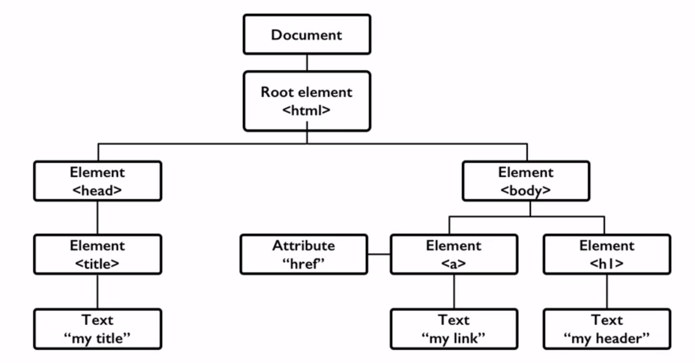

# The Document Object Model [DOM]

## 1. The Document Object Model (DOM)
* Basic of HTML is "New features should be based on HTML, CSS, the DOM, and JavaScript..."
* DOM provides common tree-like structure that all pages should follow
* Computer Scientists love trees (the mathematical kind) because you can test them.
* HTML is built on the DOM

## 2. Three Parts of a Well-formed Document
* Doctype
    * Version of HTML that you will be using
* Head
    * Metadata
* Body
    * Displayable content

### A. Doctype
* HTML5
    * `<!DOCTYPE html>`: very simple
* Previous versions dictated backwards compatibility

### B. Head
* Additional information used by the browser
    * Metadata - language, title
    * Supporting files - JavaScript, Styling, Add-ons
* Other than title, meta-data is not displayed

### C. Body
* Bulk of your page
* Important to write well-formatted (tree-like) code
* Most of the content is displayed by the browser, but there may be some meta-data too

### Example
* Example: [template.html](../codes/template.html)

## 3. Validation
### 01. Validating the Code
* W3C Markup Validation Service (https://validator.w3.org)
* Validate by URL, File Upload, Direct Input

### 02. Validating the Files
* You can also validate files that aren't on the Internet

## Review
* Well-formed pages use the DOM structure
    * Use beginning  and end tags
    * Close inner tags before outer ones
    * Use valid attributes
* Browsers will "fix" bad code, but not always well. Use a validator to check your code.