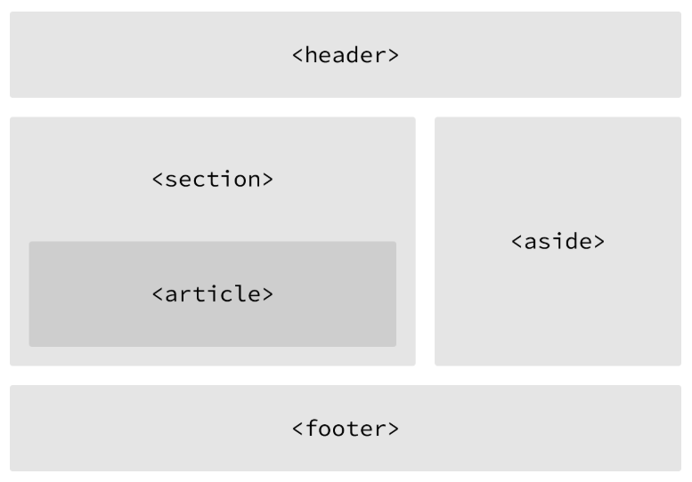

# Semantic Tags

## 1. How to Design
* The most important step in web design is the *design*
* You need to clear picture of what you want to create, before you can begin coding
<center></center>

## 2. Using Semantic Tags
* In the beginning there was `<div>`
* `<div>` was a way to group related content together
* Divs almost always had special classes/id associated with them
```
<div class="header">...</div>
<div class="section">...</div>
<div class="footer">...</div>
```
### 01. `<header>`
* A group of introductory or navigational adis: title, navigation links, etc
```
<header>
    <h1>This is the Titie</h1>
    <h2>The author is Colleen</h2>
</header>
```
* Not to be confused with `<head>` or the different headings.
